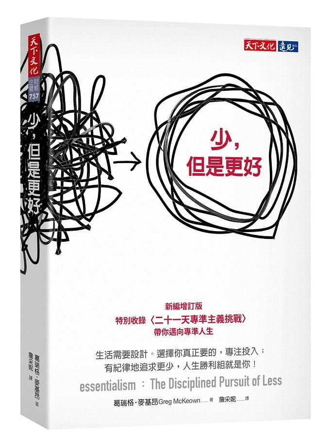

> 生活中總充滿著各式各樣的事務圍繞我們身邊，與其說圍繞，不如說像塊石頭般時刻壓著我們，偶爾覺得被困住、偶爾喘不過氣、偶爾提不起勁。。。

這本《[少，但是更好](https://www.eslite.com/product/1001122732682113274004?attr=vgHwvQoMCLqQxs4GENvo_usBEAEaJDZhMDdiMTk3LTAwMDAtMjg4ZC04OWRlLTg4M2QyNGY0YTg4MCpANzUyNWMwN2NhYjY5NDQxYTY2YmI4MmQ3OTI2M2UwNWYzZWIxNTAzZTdmZDFkNGRhMjY2MWMyMDQyYmJjNGI5ZjIoyZbwMJzWty3C8J4V1LKdFY6-nRWo5aotn9a3Lba3jC3HlvAwkPeyMDoOZGVmYXVsdF9zZWFyY2hIAVgBYAFoAXoCdHA)》是我在幾年前患上了職業倦怠時所偶然找到的電子書，當時已頗有所得。近期再重讀後，不僅多了一些新感觸外，也想結合我當前所面臨的問題來從中尋找答案。

此篇是我在主題閱讀「問題理解與共情」選的其中一本書，「問題理解與共情」是我在培養成為數據應用師或資料科學家過程中的第一個能力改善點，因為深感過去數據職涯中對於挖掘問題背後重點的理解能力缺乏，白話說就是探索重點的能力比較差，再白話說就是以前國文沒學好 😂

之所以選擇這本書是因為此書提倡對於事物的「選擇」能力，尤其是對於「最重要」事物的選擇，再把注意力全數放在這個最重要的事物，而我想知道的是如何探索並選擇所謂「最重要」的事物？

---

## 非精要主義

書中一個非常重要的概念就是「精要主義」，但如果要談精要主義就要從「非精要主義」說起，因為我過去的生活與非精要主義的敘述就是如此的貼合，很能體會其中的痛點。

由於從小父母所教導的與人為善法則，所以學生時代秉持著這項原則的我，幾乎不曾拒絕過他人的請求，這也讓我被冠上了「濫好人」的稱號，當然當時同學都比較含蓄的把「濫」字給去掉。其實當時我也不覺得有什麼影響，甚至認為我能做的就幫忙做，但時間一久，當我已經習慣無法「拒絕」的時候，實際上已經給我的生活帶來困擾。如同阿嬤節儉收藏了一堆沒在用的塑膠袋，當生活覺得每件事都很重要，無法分清楚輕重緩急時，我們有限的精力是會被榨乾的。

非精要主義闡述的就是「一切事情都很重要、一切事情都無法忽略，所有事情我們都能做到」。這點直到我出社會不僅沒有減少，反而變本加厲，社群媒體、社交群組，甚至身邊的人一會兒說理財重要，要去學習怎麼投資；一會兒說溝通技巧不可少；一會兒說提升英文口說是有必要的 ⋯⋯😫。

我想或許有很多人跟我有一樣的感受，各種資訊量每天的轟炸、社群媒體快速分享下的各種誘惑，我們的注意力與精力早就被稀釋掉了。但在資訊如此龐雜且混亂的情況下，我們如何從中抓到自己該抓的重點呢？我想精要主義給了一些可以具體實施的概念。

---

## 精要主義的具體行動

精要主義給了三個可行動的步驟：

### 1. 盡可能的探索

探索是為了後面的選擇，所以要養成「**傾聽**」與「**觀察**」，盡可能的主動去接觸所能接觸的一切事物。

然後區分「有意義的事」與「無意義的事」，這邊需要特別注意，對於別人「有意義的事」不一定對自己有意義。對自己有意義的事需取決於內心，不要以他人的評價為主，因為只有自己想做，內心會燃起來的事才是有意義的事。

### 2. 選擇與排除

接著第二步驟就是精要主義的重點，當我們主動探索了許多東西後，要同步的進行「斷捨離」，斷捨離本身就是練習選擇的方式之一，除了問自己：「這件事是我真心想要做的嗎？」外，還需要再問自己：「這件事如果現在不做也沒關係吧？」，當後者答案為確定時，則必須要進行排除。另外，當猶疑不定時，也必須進行排除。

這點可以在任何領域上實現，例如購物，假如現在是購物節，當我看到有台健身車打折還加送折價券跟最高六倍點數，此時剛好低頭看看自己的肚子，覺得買台健身車來運動好像還不錯，而且剛好有優惠，一旦過了這個村就沒這個店了，於是一眨眼就下單了 ⋯⋯。或許可以先問看看自己：「不買健身車也不會怎麼樣吧？」，當答案是「確實也不會怎麼樣」就代表它不是自己現在必須的東西。

或是人際交往上，當朋友邀請自己參加活動時，可以依活動項目或聚會頻率來做選擇與拒絕，例如讀書會即使看起來是有益的活動，但讀書會的主題並非自己的需求時，仍可以拒絕；或是參加派對，當如果發現參加派對的人都與自己職業生涯或興趣有關係的話，不妨可以參加一次，但如果頻率是每週定期參加一次的話，在評估自己或許沒那麼需要的話，是可以拒絕的。

**排除會讓我們剩下「最重要」的東西**，這點讓我想起過去做簡報的時候常獲得許多讚譽，一開始我蠻疑惑為什麼？畢竟我沒學過簡報製作技巧之類的課，但後來我研究後發現其實並不是我多有天份，而是簡報的核心就在於「簡」這個字，因為我喜歡留白，加上我不喜歡許多複雜的東西一次擺在我眼前，所以我過去製作簡報時總喜歡把繁雜的文字盡可能的刪，另外只留下最多三個重點，甚至有時三個還嫌多，因為太多重點我很難串邏輯，由於這樣反而讓別人容易從我的簡報中看到重點。

### 3. 行動

當選擇少許且重要的事後，最重要的就是把精力投注在上面，許多事情都是需要花費時間的，這是沒有捷徑的。

但即使在一開始探索與選擇時多麽喜歡的事物都可能在後續遇到困難中熱情被消磨殆盡，這並不代表一開始的選擇是錯誤的，因為當每件事追求極致時都會遇到困難，這是成長的象徵，是非常自然的一件事。

此時就需要將行動給「**系統化**」、「**自動化**」。

說到自動化這個詞我額外提一句，由於我在不同公司與自動化相關的數據部門待過好多年，工廠體系的同事對於自動化的概念多半是以硬體或設備的自動化為主；IT 部門的同事對於軟體的自動化概念則是以流程為主。系統的架構非常重要，自動化來自於單一元件間互相調用搭配，以及整體架構流程的環環相扣，排除人為的操作，甚至具備彈性可自我反饋與修正，讓系統可以自動運行。

行動自動化後有什麼優點？

第一，容易養成習慣，例如學生時代學英文背英文單字，每天捧著一本單字書一直背，這邊不說這種方法效率好不好，即使是對英文非常有熱情的人每天這樣做也會覺得枯燥。那麼就必須換個方法，建立一個有效率且自動的方式來行動。例如背單字就用 Anki 隨機抽卡的方式，每天像玩遊戲抽一點，這樣久而久之就成為習慣，甚至哪天不抽一下還會覺得怪怪的。

第二，日常瑣事不需要一直耗損意志力，由於意志力是會被耗損的，當一件事遇到困難時，此時原本日常的瑣事自動化就很關鍵，它除了節省了時間成本、體力成本外，也可以在此時動用到平時用不到而沒有被消耗掉的意志力，我們可以把注意力與精力完全放在克服困難上，更好的幫助自己跨越困難。

---

## 對於我的幫助

書中的概念對於我的幫助分為兩部分：工作與生活。

### 工作

其中在工作上幫助我最大的是「探索」，由於數據專案工作中最困擾我的是一開始的問題定義，我歸納出問題定義往往在中後期產生變動的三個原因：

需求者只能就表面痛點提出現況，但真實問題根因不明
途中需求者突然變更問題定義
隨著後期結果出來，需求者產生新想法
關於第三點是正常現象，由於需求者看到結果產生延伸想法，而提出需求進行修改問題定義，但這點我會當作是新需求或優化需求，不會推翻前面的需求。

但第一點與第二點就是可改善的地方，可改善點在於一開始的訪談就需要主動收集需求者關於此項目的各種可能資訊，即便當下聽起來沒有相關也無妨，一方面探索更多資訊，一方面同時與需求者歸納他的想法或現況，可以幫助過程中發現任何矛盾之處可以及時修正。

舉個例子，有次有個專案是要呈現流水線零件組裝經視覺辨識檢查後人員再檢查的結果，一開始需求者提供的資訊中，檢查結果只有成功或失敗兩種，沒想到在我判別原始數據時發現出現多種狀態，原來是流程會出現兩道關卡，第一道 AI 視覺辨識，第二道人工再檢查，所以可能出現 AI 視覺辨識失敗但人工看了發現沒事的情況，所以以最後結果來說，這個零件確實是成功，但數據上卻顯示是由人工強制輸入成功，而非由 AI 判決成功，在數據處理上屬於第三種狀態，必須要調整我的資料清洗策略。這件事屬於我在最一開始沒有去了解到實際的流水線流程與標準的流水線是不同的資訊，而導致後續多次溝通與修改我的工作策略，是一個可以改善的問題。

### 生活

> 如何判斷一件事的不重要性比判斷它的重要性來得更重要。

生活上對我幫助最大的自然是「選擇」與「刪除」，如何判斷一件事的不重要性比判斷它的重要性來得重要，當不確定一件事重不重要時，直接跟它 Say NO，只有當內心真心覺得這一件事很重要時，再去選擇它。
