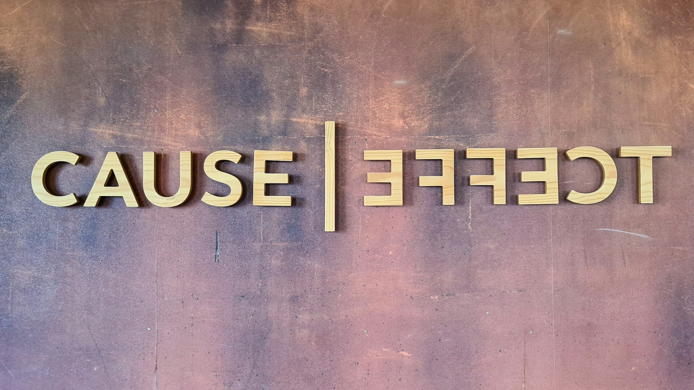

近期因為工作轉換的事幾乎讓我忘了三個月前才剛動了一刀手術，正當我感嘆新的一年日子依舊如此過的時候，發現先前已經癒合的傷口居然出現流血的跡象，這著實讓我嚇了一跳，趕忙趁空閒時上了醫院一趟，深怕是更為嚴重的內部問題。

所幸經過醫生判斷，應只是表皮傷口問題，並轉至傷口專診協助處理傷口。然而在這過程中卻給了我幾點啟發：

對於不甚清楚的問題，首先容易產生的是焦慮感，而非理性
缺乏對一領域的了解、或一知半解，會因細節造成錯誤對策
相較於因果性，人們更容易產生關聯性

## 首先跑出來的焦慮感

拒絕理性主義世界的叔本華說：「你以為的理智，不過是偽裝出來的任性。」我不一定完全同意此觀點，不過我同意人的理性只有在情緒先被安撫好之後才有登場的機會。

焦慮感也是一樣，當一件陌生又或者抓不著頭緒的事發生，且關乎自身健康時，焦慮感馬上佔據整個身心。正當我以為復原幾個禮拜的傷口又冒出血之後，一種慌張與焦慮盤旋在腦中。

不過有時候我們總會看到有人容易沉住氣，理智的判斷該怎麼做，內心充滿對其崇高的敬意。那他不是經過偽裝，就是以往豐富的經歷告訴他此時該冷靜。

沒錯！！！保持理智是可以被訓練的。

我們要先認知理性是會被情緒蒙蔽的，但要讓理性出來說話的前提就是，「請當下的情緒去後台休息」。並讓自己在一次又一次的經驗中告訴自己，遇到事情先冷靜下來。那麼具體該怎麼做呢？

大學時偶然讀到印度哲學家克里希那穆提的選集，其中有一篇提到「覺察」這個詞，他提到情緒是不可能無緣無故消失的，我們要對付當下內心自然產生的憤怒、恐懼、羞恥、焦慮等情緒，只有把自己抽離出來，以第三人稱或上帝視角來觀察這個情緒。它是流動的、可變的，所以我們常聽到有一種做法，生氣時先在內心默認 10 秒，其實也是類似的效果。

> 與其沈浸在情緒或想辦法逼自己平靜下來，不如先抽離自己「覺察」情緒，讓它流動、消散 ⋯⋯

此時理智才能夠出來，並告訴我：「不知道的事就去問專業的吧！」於是才有了上醫院找醫生的行動。

## 缺乏了解細節導致的錯誤對策

經過了解後，事實上此次的傷口是有機會不產生的，怎麼說呢？

最初來自於疤痕周圍皮膚癢手抓造成的破皮，接著消毒、塗上藥膏後，直接使用透氣膠帶貼上去，就這樣過了一個禮拜，沒想到造成傷口有潰爛並出血的跡象。根據醫生說，原因是透氣膠帶沾染濕氣後，給了傷口持續一個禮拜的「潮濕」環境，加上原有的傷口去擴散，導致現在這種情況。

簡單說就是我「自作虐」造成的，而原因在於我對於醫學常識的細節缺乏認識，總想著依過去手腳破皮的經驗，消毒後直接貼上透氣膠帶，過陣子它就自然而然地痊癒了。

然而細節就在於簡單破皮與我手術後尚未完全痊癒的疤痕是不同的，對待方式也應該不同。

有時候一知半解反而比完全不懂來得可怕，當我有了破皮的經驗，覺得可以直接套用到此次的問題上，沒想到反倒造成更為負面的效果，該引以為戒！

## 相較於因果性，人們更容易產生關聯性

在此次問題發生後，看到我如此焦慮的母親，首先說到的卻是懷疑是否是因為她近幾日煮的麻油雞造成的，她懷疑麻油雞太過補造成傷口發炎，當然這種說法也被醫生給否決了。

事實上過去我也常犯這種錯誤，當跟學弟打桌球連輸十場後，我就曾懷疑是否前幾日抽獎把運氣用完，然而這當然是無稽之談，最可能的原因只是因為我已經半年沒打球了，不管輸幾場都是應該的。

其實學統計或資料科學的人都知道，「相關性」不等於「因果性」，人們更傾向產生關聯（相關性），而非因果，這是為什麼呢？

如果學過統計學會明白，統計上對於因果性的闡述相當的少，最多就貝氏定理可以窺探前因後果的機率。我曾在《[因果革命](https://www.eslite.com/product/1001289172770898?srsltid=AfmBOopM__alw7wtCnrW7baQzmkoHNnqcqHdrBIO7hPXA0asBWnmwj_C)》這本書看到作者大力批判統計學的發明造成人們對於因果性的忽視，但作者也承認證明「因果」是有一定難度與複雜性的。

以「研究發現，冰淇淋銷售量越高，溺水死亡人數越多」這個例子來講，大多數人第一反應一定是嗤之以鼻，心想怎麼可能，然而這正是通過正統研究手法所得到的結果，只是問題不是出在研究手法，而是結論敘述的語法。然而，之所以出現相關性，來自於這兩者是有著相同原因的兩個平行事件。冰淇淋銷售量高的時候一般出現在夏天，夏天也正是游泳人數越多的時候，故「夏天天氣熱」才是這兩個事件的原因，但由於這兩者都可以串連到「夏天天氣熱」這個原因，所以說兩者有相關性是合理的，但卻千萬不可輕易認為兩者有因果關係。

回到生活上，由於相關性是具有模糊又或者說是「不精準的」，最多我們只能對其分類為高度相關、低度相關、正相關或負相關，但因果關係卻需要更為精準的推導，因此當一件事發生時，我們或許不該輕易地誤認某事物是造成問題的主因，除非有依據可循或透過方法證明其因果，否則對策不僅可能無效，甚至造成反效果，歷史上災荒獻祭不就是這等悲劇嗎？
