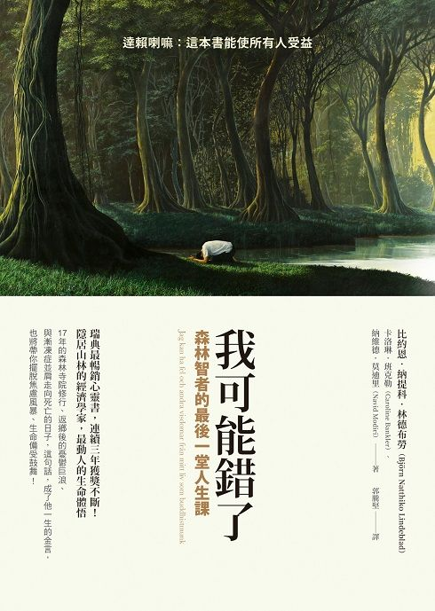

> 全名《我可能錯了：森林智者的最後一堂人生課》，講述一位瑞典經濟學家在其人生精華時毅然決然放下一切去當森林僧人，在其 17 年的修行中所發生的事以及生命體悟，在返鄉後又經歷憂鬱症以及與漸凍症並肩走向死亡的日子，其智慧給予我們勇氣。

## 從冥想獲得的體悟

我想許多人或多或少都有過冥想的經驗，就我而言，從小學開始，老師為了訓練學生的定力，曾經花了半堂課帶全班到操場講台上打坐，事實上這是我第一次接觸與冥想相關的事物。再到後來長大參加營隊、偶然在佛教電視台看到關於打坐的推廣，甚至在 Netflix 上也看過教導人們冥想的影片，本人雖沒有系統性學習過冥想，卻也不可否認冥想或多或少有其效果存在。

在人生為數不多的幾次冥想嘗試都失敗，理由是想要達到無思無想的地步難度實在太高，即使短短 30 秒都難以駕馭無數個念頭飛馳而過。這本《我可能錯了：森林智者的最後一堂人生課》並非教導人們該如何冥想，對於冥想的字眼更是提的不多，但作者卻在這本書針對「念頭」有大量的闡述與延伸。

沒錯！就是那個我們在冥想當中時不時就飄過來飄過去的念頭，像是打不死的蟑螂一樣，「念頭」總是趁我們沒有防備的瞬間竄出來。

## 關於「念頭」的五層感想

針對從書中關於念頭的敘述，我整理並獲得了五層感想：

- 第一層，**念頭的產生是自然的，要在生理學上消滅念頭是不可能的**。
- 第二層，**念頭不代表事實**。
- 第三層，**念頭本身不是問題，自動、漫不經心的判別每一個念頭才是大問題**。
- 第四層，**我的念頭不代表我**。
- 第五層，**不要相信念頭**。

先從生理的角度來探討，要完全消滅念頭是非常難的，至於是否完全不可能我難以實證，但關於其難度則非常容易觀察，回到前面的冥想體驗，我想答案呼之欲出。

再來，念頭可以是千變萬化的，不管是正面或負面。我今天可以出現想吃冰淇淋、想中樂透，或者想休假的欲望念頭；也可以出現想打人、是否會被老闆炒魷魚，或甚至自殺的負面想法；有時候焦慮也是一種類型的念頭，例如明天可能會下雨或地震、家人可能出意外、某某人是否討厭自己，又或者外星人攻打地球等不切實際的焦慮 ⋯⋯ 但可以確認的是，這些念頭大部分都不是事實。

因此如何判別念頭就是很重要的一件事，比較有批判性思維的人會去審視這個念頭（假設）是否有成立空間、是否有證據可佐證、論述是否違反邏輯等。但由於我們幾乎無時無刻不在產生念頭，不可能針對每個念頭都做這樣的判斷，所以作者提出了「覺察」來處理每個念頭。

## 覺察

第一次接觸到「覺察」這個詞是大學時在宿舍偶然看到印度哲學家克里希那穆提在其著作《[生命之書：365 日的靜心冥想](https://www.eslite.com/product/1001127581002084?attr=vgHwvQoMCKGOxs4GEKHmlJ4DEAEaJDY5ZjczM2EyLTAwMDAtMjZmYS1hZTI0LTEwZDlhMjIwZTRjNipANzUyNWMwN2NhYjY5NDQxYTY2YmI4MmQ3OTI2M2UwNWYzZWIxNTAzZTdmZDFkNGRhMjY2MWMyMDQyYmJjNGI5ZjIonNa3LceW8DDUsp0Vn9a3LcmW8DCOvp0VwvCeFajlqi2Q97Iwt7eMLToOZGVmYXVsdF9zZWFyY2hAAUgBWAFoAXoCdHA)》中提到如何對待當下產生的暴躁情緒。「覺察」這個詞非常有意思的是它有種以第三人視角來觀察自己所產生出的各種念頭，類似看電影的感覺，無論電影內容多麼高潮迭起，我們總以過客的角度來看這部電影的開始到結束。

而「覺察」很重要的一個因素是我們盡量不去干預，就像壞的念頭產生，我們就讓它出現以及結束。允許它出現，同時等待它消失，這也是冥想的實際行動中我們可操作的部分，過去總是想抑制念頭的出現，所以總會失敗，「**允許它出現，等待它消失**。」

## 不要相信念頭

既然念頭不是事實，我們可以通過覺察來對待它，那麼理所當然念頭就不代表我們自己。其實萬千個念頭中總存在不合常理或相對矛盾的念頭，我們不可能讓充滿矛盾的它們來代表我們自己，尤其最可怕的是讓其中較為負面的念頭來代表我們。

可惜的是我們確實常這麼做，或許是從幾十萬年前對於任何危險的危機意識，我們很容易讓負面念頭來充斥我們的腦袋。因此「不要相信念頭」或許是更加深刻的概念與具體的行動，正如《我可能錯了》書名所表達的內涵是同樣意思。

## 生活中的具體行動

事實上作者對於我們具體的生活方式有給予部分提示，我大致整理如下五點：

- 覺察念頭，敞開心扉「聆聽」
- 擺脫「應該」
- 信任，奇蹟永遠發生在控制之外
- 「當下」才是生命真正存在的地方
- 保持善念、盡力而為，對自我的言行道德品質負責

「覺察」在前文已提到過，除了當一個過客對待念頭，我們應當敞開心扉聆聽不同的聲音，不管是內在聲音或外在接收到的訊息，這並不代表我們需要完全接受，而是以更寬容的心去接納，不必執著於某個念頭。

因此擺脫執念的具體行動是擺脫「應該」這個詞，例如「我應該賺大錢」或「我應該升主管」等等都是執念，有時執念讓我們精疲力盡，有時人間悲劇也是由此產生。

而既然我們要擺脫「應該」這種執念，又該用什麼角度去對待這個世界呢？「信任」永遠是最好的方式，我們要學會用信任來面對各種事物，就像我們覺察念頭一樣。我們信任他人、信任上天、信任自然，最重要的是信任自己。「信任」表示我們不會去依執念或自我意識去控制任何事情，而奇蹟總會出現在此時。

我們的念頭產生往往有個前提，多是來自於過往經歷與對未來的期盼，既然念頭並非事實，也代表「過去」與「未來」不是我們該注意的焦點。高中時看過一本《[秘密](https://www.eslite.com/product/1001112701700708?attr=vgHwvQoMCOuOxs4GEKu4sK8BEAEaJDY5ZGZkNTQwLTAwMDAtMmQyNC1hZjQ4LWY0ZjVlODAzZmY2MCpANzUyNWMwN2NhYjY5NDQxYTY2YmI4MmQ3OTI2M2UwNWYzZWIxNTAzZTdmZDFkNGRhMjY2MWMyMDQyYmJjNGI5ZjIoqOWqLY6-nRXUsp0VwvCeFZzWty2f1rcttreMLcmW8DDHlvAwkPeyMDoOZGVmYXVsdF9zZWFyY2hIAVgBYAFoAXoCdHA)》，書中讓我印象最深刻的就是「當下」才是最重要的，當時還懵懵懂懂、一知半解，直到後來才漸漸意識到，原來我們頭腦中出現的各種想法多來自回憶與對未來的期望，回憶讓我們後悔、經歷賦予我們有框架的行動與信心、未來則是我們的盼望以及對未來的擔憂，這些都可涵蓋在本文討論的關鍵字「念頭」當中。

但我們對後悔的回憶以及不可掌握的未來無法產生具體的行動，那麼就只有連接過去與未來的「當下」是證明我們存在的唯一空間，也是我們可以「選擇做」以及「實際做」的唯一地方。

至於我們該用什麼心態去「做」呢？「心存善念，盡力而為」、「對自我言行道德品質負責」，不僅要正向積極，更要敢做敢當，對自己負責！

## 關於我的延伸思考

事實上我在 2023 年中遭遇了我人生中很重要的挫折，我生了一場大病，做了成功率高卻危險性也高的手術。即使手術成功後也還是遭遇復健過程中各式各樣的磨難，直至這篇文章撰寫當下，我仍苦受一般感冒病毒帶來在虛弱身體具一定程度的發燒打擊。

其實回顧這段幾個月的歷程，我產生了無數個負面念頭，每個念頭都是一種折磨，焦慮、痛苦與迷茫充斥內心，即便一個小症狀都會讓我上演內心劇場。

但這本書也給予了我力量，如果拋棄了那些似是而非、不切實際的念頭，其實只面對當下反而能帶來寧靜，雖然這很難沒錯，不過哪怕是一秒的寧靜都帶給我莫大的能量。當情緒不再為了外在某些情況而起伏時，實際上我也能夠比較理智，信任生命的本身也是一個智慧。
