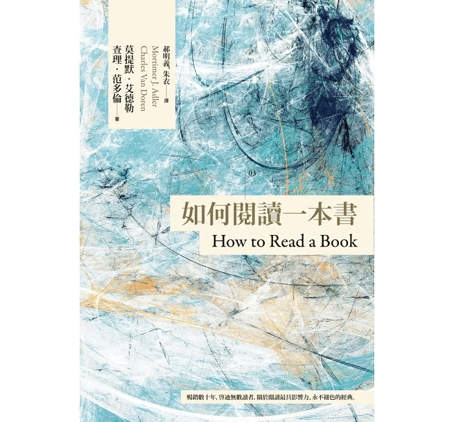

> 這本《如何閱讀一本書》是我為了培養閱讀與理解能力，所閱讀的系統學習書籍之一。書中將閱讀分為四個層次，分別是：基礎閱讀、檢視閱讀、分析閱讀，以及主題閱讀。閱讀本書的目的是初步建構出我的閱讀系統，以幫助後續培養數據應用的素質培養：閱讀與理解。

## 閱讀的痛點＆盲點

我想很多人可能跟我一樣，明明就閱讀過一本書，但在閱讀完沒多久再回想時，竟然好像沒讀過這本書一樣；又或者是明明記住當中的幾個重點，但卻無法用很清晰的語言來說明這本書的結論，以及支持其的論證。

過去我曾經癡迷於所謂「一年讀 100 本書」諸如此類的行為，而我也確實曾在幾年前幾乎快完成這個「壯舉」。當時午餐時間、下班後幾乎都在閱讀，然而我的方式就是土法煉鋼：「把一本書從頭到尾看完」，然後記個記號，但在閱讀了將近十個月後，正當我開始得意於能在期限內完成時，我發現了幾個問題：

- 失去了過去閱讀的那種輕鬆感
- 為了達成目標，我得了很多其實內容沒辦法帶給我收穫的書
- 每當有一個印象有在哪裡讀過時，卻因為沒做筆記跟書籤而找不到在哪

當然「閱讀」了這麼多書，不能說完全沒有收穫，例如我從書中認識了很多以前沒聽過的人物，也認識了很多作家等。但缺點跟盲點卻也不少，除了上面發現的問題外，我這個行為猶如「囫圇吞棗」，實際上這樣的一知半解狀態比完全不懂還要可怕，會陷入「自我懷疑」以及「過度解釋」的結果，在我的反思裡，這樣的行為或許跟看斷章取義的新聞，或是看抖音等短影音那樣的「被動」結果差不多。

## 閱讀的 4 個層次

正如前言提到的，這本書將閱讀分為四個層次，分別為：基礎閱讀、檢視閱讀、分析閱讀，以及主題閱讀，這四個層次是逐漸堆疊上去的，換言之，檢視閱讀是包含基礎閱讀，而分析閱讀則是包含基礎閱讀與檢視閱讀，以此類推。

基本上讀完國中與高中應該就會具備最基礎的「基礎閱讀」，但為避免遺漏，作者仍針對基礎閱讀的內容進行闡述，這邊做簡單的整理：

- 具備基礎的聽力與視力，以及最起碼的認知能力
- 具備認字能力
- 具備字彙的運用
- 具備獨立完成閱讀一本書，並幾乎可閱讀所有的讀物

事實上並非所有國高中畢業的學生完全具備這些能力，光是「字彙的運用」就呈現高低能力差異。說到這裡，讓我想到一個笑話，當一個非英語系國家的學生在學習英語時，老師跟學生說：「你再不加油就完蛋了，在美國，就連流浪漢的英文都比你好。」

是的，這確實如此，但今天不討論母語與非母語的差異，重點在於，有的人僅會使用基礎溝通的口語，但那僅僅只是能溝通罷了，要想完成更複雜詞彙的運用，或者是理解一段文字背後的意涵等。就拿中文特有的「成語」來說，僅用四個字（少部分成語非四個字）就可以表達一個深刻的意思。而在台灣，似乎並非很多人能順暢應用所有成語（包括我在內），這就是「字彙的運用」仍有待提升的狀況之一。

## 檢視閱讀

《[如何閱讀一本書](https://www.eslite.com/product/1001117012558322?attr=vQHwvAoLCLqPxs4GEOXakDoQARokNjllM2U0MTYtMDAwMC0yMGEwLWI4OTUtNTgyNDI5YWRlODA0KkA3NTI1YzA3Y2FiNjk0NDFhNjZiYjgyZDc5MjYzZTA1ZjNlYjE1MDNlN2ZkMWQ0ZGEyNjYxYzIwNDJiYmM0YjlmMiiQ97IwnNa3LcLwnhXUsp0Vjr6dFZ_Wty2o5aottbeMLceW8DDJlvAwOg5kZWZhdWx0X3NlYXJjaEgBWAFgAWgBegJ0cA)》書中讓我收穫最多的就是「檢視閱讀」了，它的重點在於「在一定時間內進行『系統化略讀』，並試圖抓出這本書的重點」，這句話其中就包含了三個重點：

第一個就是「一定時間內」，檢視閱讀不能花太久時間，至於要花多少時間呢？作者大致給出了「一小時」的答案，不過我認為這可能因人而異，依我自己而言，或許一小時還太長，半小時到 40 分鐘差不多，這是因為我的專注力大概落在這區間，甚或有人覺得利用番茄鐘的 25 分鐘我都覺得可以。

第二個是「**系統化略讀**」，記住，這裡的重點是「系統化」，而非隨意翻一翻，至於具體該怎麼做，作者大致給出了幾個方向，包含：

- 看書名與副標題
- 看作者序
- 看目錄頁，目的是了解最起碼的架構
- 看索引，能大致上了解作者都會用到哪些詞彙
- 看出版者的介紹，通常在封面、書側與書背都會有出版者下的「廣告詞」，這些會精練出來出版者想給讀者的重點
- 由目錄頁挑選出幾個跟「你」所認知與主題息息相關的章節來「略讀」
- 隨便東翻翻、西翻翻，並看看開頭、結尾與作者後記

第三個是「**抓出這本書的重點**」，學會問一些典型的問題，答案可以在後續的分析閱讀中得到，例如：

- 這本書在談什麼？作者主要的論點是什麼？
- 這本書的架構如何？這本書包含哪些部分？
- 這本書跟自己有什麼關係？這本書的資訊對自己可能有幫助嗎？

簡而言之，在「檢視閱讀」這一項就是閱讀一本書的前置作業與基本門檻，它讓我們直接將「閱讀」與「思考」進行結合，化被動為主動，這樣才不會每次拿到一本書，囫圇吞棗過後，似乎跟沒看沒什麼兩樣。

## 分析閱讀

不可諱言在「分析閱讀」已經進入了比較困難的層次，在這一個層次裡，作為讀者是需要進行「鍛鍊」的，為什麼這麼說呢？

在這一個階段需要關注的重點是「專注理解」，相當於要咀嚼這本書，在無限期的時間內達到「不吸收它誓不罷休」的境界。但如果一本書擁有很多讓我們吸收的點，是否就需要花上很多時間與精力去咀嚼它呢？而這樣的「作業量」又豈是未經過鍛煉的我們能達到的呢？

作者先是給出了「這麼做能得到很大的效益」的結果來吸引人，再給出「練習量越大，困難度逐漸降低」來安慰我們，而我也被他給說服了。所以在後續我就先實際執行了一遍（觀看後續《花掉的錢都會自己流回來》讀後感）。

而實際作法確實也不算難，只是很耗時間而已，儘管我沒能做到盡善盡美，卻也收穫良多。作者給出的實際作法有兩階段，包含「找出一本書在談些什麼的規則」，以及「詮釋內容與訊息」，詳細該怎麼做可以參考《如何閱讀一本書》原書，我謹列出了幾個打動我的點。

- 為書籍進行分類，包含「論說類書籍」與「虛構類書籍」，其中論說類書籍又分成「理論性」與「實用性」兩種。
- 將重要章節列出出來，並根據其秩序、關係與重點進行「架構的重構」。
- 找出作者想解決的問題

分類是我們人類與生俱來的能力，講得更通俗一點，我們本來就很會給各種事物「貼標籤」，甚至都不用別人教我們，我們自己就會。而對於書籍的分類，我們可以有自己一套分類方式，也可以參照前面作者提供的方式，它有助於我們以不同方式進行閱讀。

「架構」一直是我們軟體行業或數據行業在執行業務時非常重要的一環，而書籍的「架構」也同樣如此。我們數據行業需要架構是為了讓執行有流程，且更穩定、更有效率；而書籍的架構則是讓作者可以將其對於「核心思想」的表達透過加入其他例如舉例、印證等方式來讓讀者讀到比較有邏輯且不失可讀性的內容，這種方式是將那些列表式的重點攤開隱藏在白話內容裡，所以「重構架構」也是讀者需要做的。

當然以上的目的都是為了找出作者想表達的重點，但我們可以進一步想到「作者究竟為何要表達這個重點呢？」，我們可以想見作者一定是有想「解決」的問題，這個才是作者寫這本書的「出發點」，而這也才是我們想要找尋的東西。

另外作者也特別花了幾個章節特別強調「用詞的精確性」，不僅僅是因為許多詞有多種含義，更重要的是如果作者使用一個詞代表某種意思，而讀者讀成另一種意思，可能會造成的理解偏差。雖然原書花了不少力氣闡述字詞含義這件事，但目前的我所能理解的僅僅如此而已，期待未來重讀時，閱讀理解能力增長時的我能夠更精確理解作者的意思。這是題外話，不過這也令我意識到此刻的我在閱讀這本《如何閱讀一本書》時，存在著閱讀理解問題，但能夠覺察問題本身就是件好事，而讀到超過自己認知能力範圍的書，不也是一種成長嗎？

## 主題閱讀

實際上作者對於此項沒有過多描述，並非主題閱讀不重要，恰恰相反，主題閱讀是在分析閱讀的基礎上，加入了讀者對於同類型的問題或重點，去擴展閱讀相關書籍，藉由不同作者、不同論證方式等，交織而成對於一個觀點的理解。

而主題閱讀的重點就在於「該如何與自己連結」，又或者可以說是「影響自己去行動」，這個重點是我自己下的，但我認為閱讀的核心是讀者本身，書籍本身恰恰僅是一種工具，正如「一千個人心中有一千個哈姆雷特」一樣，我們並非為了閱讀而閱讀，應該是為了追尋某種東西而閱讀。如果想從情感上得到慰藉，讀讀小說或詩文，從文章中得到共情與安慰，何嘗不是一種解決方式；又如同本書所介紹的方法的目的，就是為了增進閱讀理解能力，那在分析閱讀的基礎上進行鍛煉，找到能夠讓自己成長的書，也是一種目的。

事實上作者在最後提到，有許多書根本不適用這些方式，原因在於有些文學書根本找不到這些方式；另外也在於能讓我們用這樣的方式提升自己閱讀理解能力的書比例其實很少，許多書早就在我們的認知範圍內；也有許多書其根本的目的僅僅只是為了娛樂讀者而已。或許回到閱讀的本質，痾～或者說是我認為的閱讀的本質：「**與自己連結，對自己產生影響進而去行動**」，那麼「選擇」就十分重要了！
